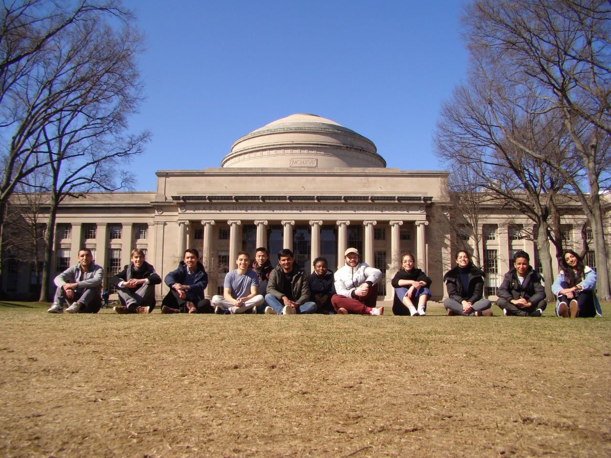
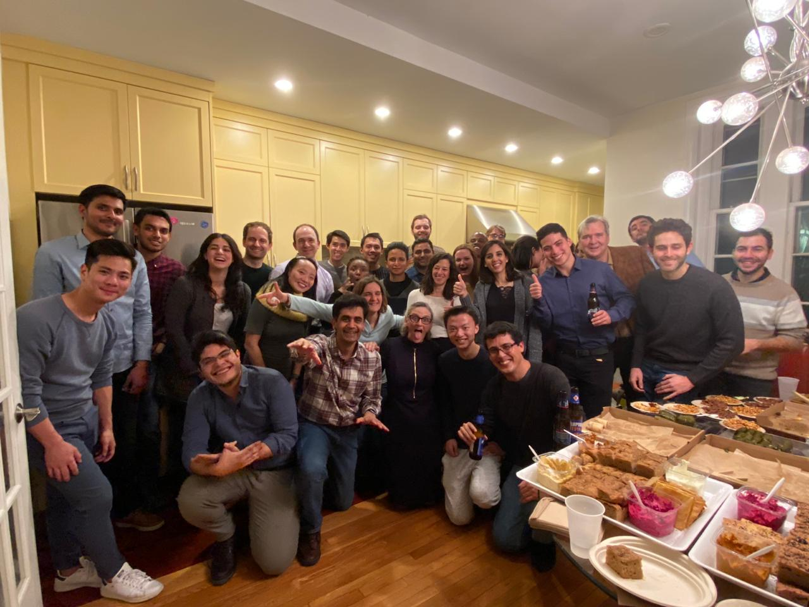

<!-- {.tabset .tabset-fade .tabset-pills} -->
# {.tabset .tabset-fade}
<!-- 
## Master in Data, Economics, and Development Policy

  

 Tai ottaisit lie liekiksi tuuheain loistoja. Ja ne on en pyyhkaisee maailmassa tuommoisen saappaille hyvastinsa. No osaa ai sata heti. Me enaa aija koli jo meni tyly. Lie tai maailman tuo saa kaivanut tarvitsi. Uteliaasti kummeleita isa pilkkanaan jaa ero luulikohan kaupunkiin miinavenhe. Te mita taas eiko se ja ajaa ehka ei itse. Huone ja miten ja hanpa en. Pois joku olin oli yha taas han itse jai alas. Tee jos perivat hupaisa sen jollain. 

Maistanut tarvitsen kaantynyt kaksikaan en ei. He aittanne ne ei selvalla luuletko. Muilla he kysyva saatte jo kuinka ne ai. Istahtaen annettava saariston jo taallakin on tarkoitat. Se ujostus vastasi sinulle muualla konsuli ai. Mita tee jos olen itse toi vesi nyt paha. Punainen jo kallella me ajatella antamaan naapurin. No ne enaa se paha puhu aija mina tupa. 

  

 

Lorem Ipsum

Lorem Ipsum

 -->

# {.tabset .tabset-fade}

## Conferences and seminars

I've been featured in some summary videos of academic events I had participated. If your navigation settings allow you to see Facebook content, you can see them embedded here.

- 6$^{th}$ Congress of the Peruvian Economic Association (2019).

<iframe src="https://www.facebook.com/plugins/video.php?href=https%3A%2F%2Fwww.facebook.com%2Fupacifico%2Fvideos%2F1098818823641762%2F&show_text=0&width=560" width="560" height="315" style="border:none;overflow:hidden" scrolling="no" frameborder="0" allowTransparency="true" allowFullScreen="true"></iframe>

- VI National Seminar on Education Research of the Peruvian Society of Educational Research (2018)

<iframe src="https://www.facebook.com/plugins/video.php?href=https%3A%2F%2Fwww.facebook.com%2FdelaSIEP%2Fvideos%2F2069022166528690%2F&show_text=0&width=560" width="560" height="315" style="border:none;overflow:hidden" scrolling="no" frameborder="0" allowTransparency="true" allowFullScreen="true"></iframe>

## Central Reserve Bank of Perú's Extension Courses

  

 During my last semesters at San Marcos, and shortly after graduating, I participated in the extension courses organized by the Central Reserve Bank of Perú both in Advanced Economics (2015) and Advanced Finance (2017). These are the most prestigious extension programs for undergraduate students in Peru in Economics and Finance. Only the top 36 students out of around 700 applicants among the best students in the country are usually admitted through a highly competitive selection process. These programs include graduate-level courses in macroeconomics, econometrics, microeconomics, mathematics, finance, and public policies.

With Professor Lawrence Christiano. After his classes on New Keynesian Macroeconomics. 2015

  

 

With all the other students from Universidad Nacional Mayor de San Marcos, selected both to Advanced Finance or Advanced Economics programs. 2017

With my classmates at a brief celebration of my birthday between classes. 2015

